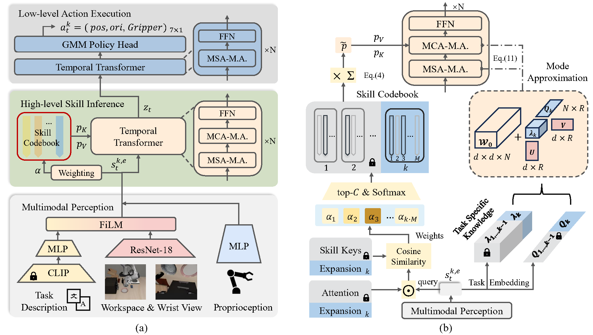

<div align="center">

## **SPECI: Skill Prompts based Hierarchical Continual<br>Imitation Learning for Robot Manipulation**


Jingkai Xu, Xiangli Nie


<a href="https://arxiv.org/pdf/2504.15561">[Arxiv Paper]</a>
</div>




<div align="center">

# Abstract

</div>

Real-world robot manipulation in dynamic unstructured environments requires lifelong adaptability to evolving objects, scenes and tasks. Traditional imitation learning relies on static training paradigms, which are ill-suited for lifelong adaptation. Although Continual Imitation Learning (CIL) enables incremental task adaptation while preserving learned knowledge, current CIL methods primarily overlook the intrinsic skill characteristics of robot manipulation or depend on manually defined and rigid skills, leading to suboptimal cross-task knowledge transfer. 
To address these issues, we propose Skill Prompts-based HiErarchical Continual Imitation Learning (SPECI), a novel end-to-end hierarchical CIL policy architecture for robot manipulation. The SPECI framework consists of a multimodal perception and fusion module for heterogeneous sensory information encoding, a high-level skill inference module for dynamic skill extraction and selection, and a low-level action execution module for precise action generation. To enable effective  knowledge transfer on both skill and task levels, SPECI performs continual implicit skill acquisition and reuse via an expandable skill codebook and an attention-driven skill selection mechanism. 
Furthermore, we introduce Mode Approximation to augment the last two modules with task-specific and task-shared parameters, thereby enhancing task-level knowledge transfer. 
Extensive experiments on diverse manipulation task suites demonstrate that SPECI consistently outperforms state-of-the-art CIL methods across all evaluated metrics, revealing exceptional  bidirectional knowledge transfer and superior overall performance.

# Contents

- [Installation](#Installation)
- [Datasets](#Dataset)
- [Getting Started](#Getting-Started)
  - [Task](#Task)
  - [Training](#Training)
  - [Evaluation](#Evaluation)
- [Citation](#Citation)
- [License](#License)

# Installtion

Please run the following commands in the given order to install the dependency for **SPECI**

```
conda env create -f environment.yml
conda activate speci
git clone https://github.com/Triumphant-strain/SPECI.git
cd SPECI
python -m pip install -e . 
```
Or you can use the following commands to install but may lack some dependencies, which you need to install manually according to *environment.yml*.
```
conda create -n speci python=3.8.13
conda activate speci
git clone https://github.com/Triumphant-strain/SPECI.git
cd SPECI
pip install -r requirements.txt
pip install torch==1.11.0+cu113 torchvision==0.12.0+cu113 torchaudio==0.11.0 --extra-index-url https://download.pytorch.org/whl/cu113
python -m pip install -e . 
```
Since we utilize [[LIBERO]](https://github.com/Lifelong-Robot-Learning/LIBERO?tab=readme-ov-file) as our codebase, the project `libero` should be installed for direct import.

# Getting Started

## Datasets & Checkpoints

Please download the LIBERO dataset seperately following their [docs](https://lifelong-robot-learning.github.io/LIBERO/html/algo_data/datasets.html#datasets), and put it under `libero/datasets`. Then download the CLIP checkpoint from [Hugging Face](https://huggingface.co/openai/clip-vit-base-patch32) and put it under `libero\lifelong\openai\clip-vit-base-patch32`.

## Training

To start a continual learning experiment, please choose:
- `BENCHMARK` from `[LIBERO_SPATIAL, LIBERO_OBJECT, LIBERO_GOAL, LIBERO_10]`
- `POLICY` from `[bc_hierarchical_transformer_cp_prompt_policy, bc_hierarchical_transformer_cp_policy, bc_hierarchical_transformer2_prompt_policy, bc_transformer_cp_prompt_policy, bc_transformer_policy]`
- `ALGO` from `[base, er, ewc, packnet, multitask, task_specific_parameter]`

then run the following:

```shell
export CUDA_VISIBLE_DEVICES=GPU_ID && \
export MUJOCO_EGL_DEVICE_ID=GPU_ID && \
python libero/lifelong/main.py seed=SEED \
                               benchmark_name=BENCHMARK \
                               policy=POLICY \
                               lifelong=ALGO
```

## Evaluation

By default the policies will be evaluated on the fly during training. If you have limited computing resource of GPUs, we offer an evaluation script for you to evaluate models separately.

```shell
python libero/lifelong/evaluate.py --benchmark BENCHMARK_NAME \
                                   --task_id TASK_ID \ 
                                   --algo ALGO_NAME \
                                   --policy POLICY_NAME \
                                   --seed SEED \
                                   --ep EPOCH \
                                   --load_task LOAD_TASK \
                                   --device_id CUDA_ID
```

# Citation
If you find **SPECI** to be useful, please consider citing our paper:

```bibtex
@article{xu2025speci,
  title={SPECI: Skill Prompts based Hierarchical Continual Imitation Learning for Robot Manipulation},
  author={Xu, Jingkai and Nie, Xiangli},
  journal={arXiv preprint arXiv:2504.15561},
  year={2025}
}
```

# License
This project is licensed under the MIT License - see the [LICENSE](LICENSE) file for details.


# Acknowledgements
1. We would like to thank the authors of [LIBERO](https://lifelong-robot-learning.github.io/LIBERO/) for providing the datasets, environments and codebase for our experiments.